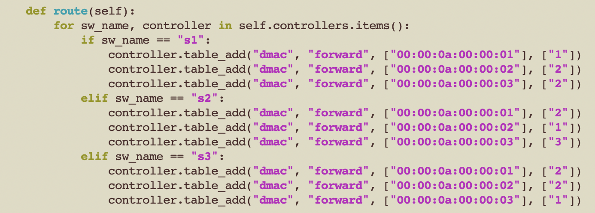
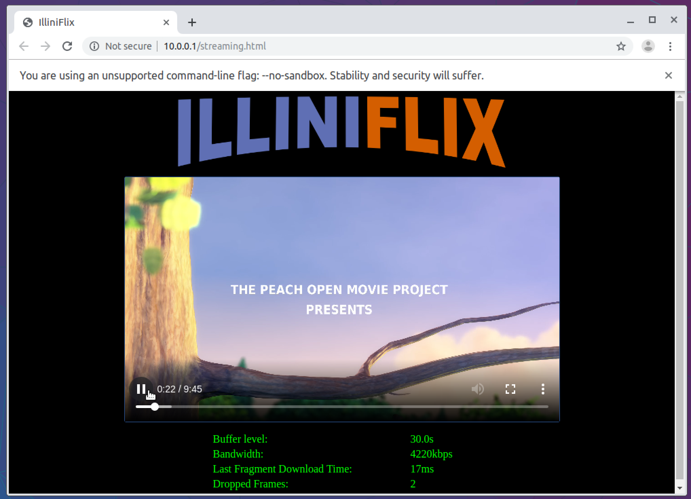
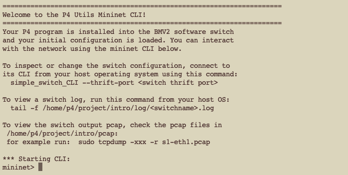

# Project 1: Get started with Line and Circle Topologies

## Objectives

* Set up the environment in your computer
* Learn about the basic components that you will need for future projects through a toy example: Mininiet, P4 program, controller
* Using some of the tools, write your own circle topology
* Run example applications on your toy example and learn how to read their performance numbers

## Get Started

### Set up the environment

We run all our programs in a virtual machine. The VM has the P4 and Mininet environment already set up for you.

- **Install a virtual machine hypervisor software.** such as VirtualBox, VMWare, and KVM. You can use any of them.
- **Download the virtual machine we prepared**. The virtual machine file can be downloaded in the following link: <https://drive.google.com/open?id=1QFy58C3Tgm0x4e_Y3nPDggY-iBey3ekT>
- **Install the VM.** Directly use your virtual machine software to open the VM file downloaded. The username and the password of this VM are both **p4**.
  *Note*: The VM file is large. It could consume about 40G disk size in your laptop. Please reserve enough space in your disk before installing the VM.
- **Login to the VM.** Usually it is hard to use the virtual machine directly through your hypervisor. We have installed OpenSSH server in this virtual machine so that you can use it through ssh command. You can connect to your virtual machine by typing:  `ssh p4@localhost -p 1338`


### Clone Project Contents

After booting your virtual machine, you need to clone this project repository in your virtual machine

```
git clone https://github.com/Harvard-CS145/projectX-YYY.git
```

where X (1-8) is the project number, and YYY is your Github username. The description and code skeletons of each minor project are in this repository. In this repository, you will finish your coding in each minor project, test your programs, and submit your codes into Github for grading.


## Tutorial: The line topology example

To start this tutorial, please enter in the project directory

```
$ cd projectX-YYY
```

### Create the line topology

Let's first create the physical topology of the network in *Mininet*. The Mininet program automatically creates a virtual topology based on a *JSON configuration file*.
The JSON configuration file should:
- Define hosts and switches.
- Define the links, i.e., how hosts and switches connect with each other to form your topology.
- Define the P4 program we want to run on the switches.

As an example, we provide you with a line topology in the file `line/p4app_line.json`.
The line topology has three hosts ("h1", "h2" and "h3") and three switches ("s1", "s2", and "s3"). There are five links: one connecting "h1" and "s1", "h2" and "s2", "h3" and "s3", "s1" and "s2", "s2" and "s3".


In this configuration file `line/p4app_line.json`, you only need to focus on the following fields:

- `program`, which points to the P4 program we want to apply to the switches. We set it to `p4src/l2fwd.p4` in this project.
- `topology`, which describes the topology. In the topology field, we need to focus on `links`, `hosts`, and `switches`. As shown in the following figure, we put the three hosts in the `hosts` subfield, and put the three switches in the `switches` subfield. We also put the five links in the `links` subfield.


To run the Mininet with this topology, you can input the following command

```
$ sudo p4run --config topology/p4app_line.json
```

**References:** For more information about Mininet, please refer to:
- <http://mininet.org/walkthrough/>
- <https://github.com/mininet/mininet/wiki/Documentation>

### P4 program

The P4 program is the code that specifies packet processing at switches.
For our toy example of the line topology, we provide the P4 Program `p4src/l2fwd.p4`. The program defines a **dmac** table which maps the destination MAC address to the output port. In this project, you do not need to edit this P4 code. In future projects, writing P4 code is a central part of your work.

### Controller
The controller is responsible for filling entries in the match-action tables defined by the P4 programs. The controller runs the routing algorithm, generates forwarding rules, and installs the rules into the tables at switches.

We provide you with the controller file for the line topology in `controller/controller_line.py`.
Our controller file already implemented some small functions that use the `Topology` and `SimpleSwitchAPI` objects from the **p4utils** lib.

In this example, the main task is to implement the `route` function which installs entries in Table *dmac* to forward traffic. At a high level, the `route` function uses `table_add` function (provided by the `SimpleSwitchAPI`) to insert forwarding rules. The parameters of this function is `[table name]`, `[action]`, `[list of keys]`, and `[list of outputs]`.

As shown in the following figure, we install forwarding rules for all three switches. For each switch, we call function `table_add` to install forwarding rules. These rules forward packets to the corresponding output port based on the destination MAC address.
The first parameter `dmac` is the table name, and the second parameter `forward` is the action name. Both parameters are defined in the P4 program that we will talk more in later projects. The third parameter is the destination MAC address, and the last parameter is the switch output port index.



**Note:**

- By default hosts get assigned MAC addresses using the following pattern: `00:00:<IP address to hex>`. For example if h1 IP's address were `10.0.1.5` the MAC address would be: `00:00:0a:00:01:05`. The default IP address of host hX is `10.0.0.X`.
- Switch port index each host is connected to. There are several ways to figure out the port index to interface mapping. By default p4-utils add ports in the same order they are found in the links list in the p4app.json configuration file. Thus, if you write links in this order [[h1, s1], [h2, s1]], then port 1 of s1 will connect to h1, and port 2 of s1 will connect to h2. However, this basic port assignment might not hold for more complex topologies. Another way of finding out port mappings is checking the messages printed by when running the `p4run` command:

	```
	Switch port mapping:
	s1:  1:h1	2:h2
	```

**References:** For more references in writing controller codes, please refer to the document <https://github.com/nsg-ethz/p4-utils/blob/master/README.md>.


### Run the Line Topology

Now we have all the components in the line topology, we can run our network with the following commands.

**Start the topology**
```
$ sudo p4run --config topology/p4app_line.json
```
**Run the controller**

Start another terminal, and run
```
$ python controller/controller_line.py
```
**Test the connectivity**

To test the connectivity between all pairs of hosts, go back to the first terminal, type
```
mininet> pingall
```
To test the connectivity between any two hosts, for example, `h1` and `h2`, type
```
mininet> h1 ping h2
```
**Stop the network**

To stop the command, in the first terminal, type
```
mininet> exit
```

## Running Applications on your network

Now that you have created your network successfully, you can run different applications on it.
We provide you with three different types of applications: Memcached, Iperf, and video streaming.
These applications will also be used in future projects.

### Video streaming

**Start a video streaming server at host `h1`**
```
$ ./apps/start_vid_server.sh h1 10.0.0.1
```
This command starts a video streaming server at host `h1`, and the IP address of `h1` is `10.0.0.1`.

**Open the graphical interface**
```
$ sudo service lightdm start
```

**Start the client**

Open the terminal in the graphical interface (Menu => System Tools => LXTerminal, or try CTRL-ALT-T). In the terminal, go to the project 1 directory, and type:
```
$ ./apps/start_vid_client.sh h2 10.0.0.1
```
This command opens a Chrome web browser on host `h2` which visits a video website served on `10.0.0.1`. If you ran your server on a host other than `h1`, then change `10.0.0.1` to that IP.
Try playing the video. You should see something like this:



### Memcached and Iperf.

**Generate request trace**

We provide you with a trace generator which generate requests for Memcached and Iperf.
```
$ python ./apps/trace/generate_trace.py [hosts running memcached] [hosts running iperf] [trace length (sec)] [trace file name]
```
For example, if you want to run Memcached on host `h1-h3`, run Iperf on host `h1` and `h3`, and generate a trace for 60 seconds, you can type:
```
$ python ./apps/trace/generate_trace.py 1-3 1,3 60 ./apps/trace/test.trace
```

<!-- Every 100ms, I generate a burst of memcached requests, the distribution of  -->

After generating the trace, you will find a file named `test.trace` in `apps/trace` directory.

**Run Memcached and Iperf**

We provide you with an easy script to run Memcached and Iperf servers and clients on hosts:
```
$ sudo python ./apps/send_traffic.py ./apps/trace/test.trace 1-3 60
```
Then you will run your applications for 60 seconds. After finishing running, you will get the results, including the latency of memcached requests and the throughput of iperf requests.
```
start iperf and memcached servers
wait 1 sec for iperf and memcached servers to start
start iperf and memcached clients
wait for experiment to finish
stop everything
wait 10 sec to make log flushed
Average latency of Memcached Requests: 326.585716909 (us)
Average log(latency) of Memcached Requests: 1.37206216773
Average throughput of Iperf Traffic: 23454086.8092 (bps)
Average log(throughput) of Iperf Traffic: 6.24738717264
4.87532500491
```

**Check logs**

You can check the result files in `logs` directory. In this directory, you can find files like `hX_iperf.log` or `hX_mc.log`.
In files `hX_iperf.log`, each line represents the average throughput of one iperf request, which is issued by host `hX`.
In files `hX_mc.log`, each line represents the request latency of one memcached request, which is issued by host `hX`.

*Note*: if you are using Windows laptop, please be aware about that Windows and Linux handle newlines differently. Windows uses `\r\n` at the end of a line, while Linux uses `\n`. Therefore, please do not edit those files in your Windows host. If you want to use some text editor to edit the files in the VM through SSH or SFTP, be sure to set the correct newline symbol.

## Your Task: Build the Circle Topology

In this project, your task is to build the circle topology based on the line topology example we provide you. The circle topology is shown in the following figure. It has three switches and three hosts. The three switches are connected with each other in a circle rather than a line.


<!-- In this project, you need to first describe the topology in the `p4app_circle.json` file, and then write your controller code in the `controller_circle.py` file. You should use the line topology files as a starting point. -->

### Coding files

In this project, you need to create two and submit two files:

* **Topology**: Write the JSON configuration file for the circle topology in `topology/p4app_circle.json`. You can first copy `topology/p4app_line.json`, and then modify the `topology` field within that file.

* **Forwarding Rules**: Write forwarding rules for the circle topology in `controller/controller_circle.py`. You can first copy `controller/controller_line.py`, and then modify the `route` function to create forwarding rules.

### Testing

Once you finish coding, you can test your solution in the following steps:

1. Start the topology

	```
	$ sudo p4run --config topology/p4app_circle.json
	```

	

   You will see the `mininet>` prompt if the command ran successfully.

2. Run the controller

	```
	$ python3 controller/controller_circle.py
	```

	This will insert the forwarding rules into your switches. Here is what your output should look like:
	```
	Setting default action of dmac
	action:              drop
	runtime data:        
	Setting default action of dmac
	action:              drop
	runtime data:        
	Setting default action of dmac
	action:              drop
	runtime data:        
	Adding entry to exact match table dmac
	match key:           EXACT-00:00:0a:00:00:01
	action:              forward
	runtime data:        00:02
	Entry has been added with handle 0

	Adding entry to exact match table dmac
	match key:           EXACT-00:00:0a:00:00:02
	action:              forward
	runtime data:        00:02
	Entry has been added with handle 1

	Adding entry to exact match table dmac
	match key:           EXACT-00:00:0a:00:00:03
	action:              forward
	runtime data:        00:01
	Entry has been added with handle 2

	...
	```
	*Note*: Your output could be a little different from it according to your implementation of the `route` function.

3. To test the connectivity of your network, use `pingall` on the mininet shell

	```
	mininet> pingall
	*** Ping: testing ping reachability
	h1 -> h2 h3
	h2 -> h1 h3
	h3 -> h1 h2
	*** Results: 0% dropped (6/6 received)
	mininet>
	```

4. We provide you with a testing script in `tests/test_circle_topo.py`. Run it, and your network should pass all tests.

	```
	$ python3 tests/test_circle_topo.py
	```

	If the script completes, then you pass all tests.

## Debugging and Troubleshooting

### Commands Supported in Mininet

- `help`: list all the supported commands.
- `nodes`: list all the hosts and switches you just created.
- `net`: list all the links you just created. For example,

    ```
    h1 h1-eth0:t1-eth1
    # port 0 of host h1 and port 1 of switch t1 are connected.
    a1 lo:  a1-eth1:t1-eth3 a1-eth2:t2-eth3 a1-eth3:c1-eth1 a1-eth4:c2-eth1
    # port 1 of switch a1 and port 3 of switch t1 are connected
    # port 2 of switch a1 and port 3 of switch t2 are connected
    # port 3 of switch a1 and port 1 of switch c1 are connected
    # port 4 of switch a1 and port 1 of switch c2 are connected
    ```

- `links`: list all the links you just created.
- `h1 ping h2`: ping h2 from h1; you will see prompt stopped, since there is no forwarding rules on switches for sending packets from h1 to h2. (ctrl + c will kill the `ping` command).
- `h1 <commands>`: run a command on host h1.
- `pingall`: ping between any host pair; you will see prompt stopped, since there is no forwarding rules on switches for sending packets from h1 to h2. (ctrl + c will kill the `pingall` command).
- `exit`: quit the Mininet CLI.

### P4 Switch Logs

Each p4 switch provides a log file for debugging. Those files are located in the `log` directory.
Within this directory, you can see files named `sX.log`, which indicates this file is the log file for switch `sX`.
The log file records all operations happen within this switch.
You only need to focus on two kinds of records: adding table entry and packet processing.

When you use your controller script to add table entry in the P4 switch, there will be some words in the log file:
```
[11:18:35.237] [bmv2] [T] [thread 15987] bm_table_add_entry
[11:18:35.237] [bmv2] [D] [thread 15987] Entry 0 added to table 'MyIngress.dmac'
[11:18:35.237] [bmv2] [D] [thread 15987] Dumping entry 0
Match key:
* hdr.ethernet.dstAddr: EXACT     00000a000001
Action entry: MyIngress.forward - 1
```
which means you add a table entry, whose key is the destination MAC address `00000a000001`, and the action is `forward(1)`.

After the switch processes a packet, there will also be some words in the log file:
```
[11:19:01.206] [bmv2] [D] [thread 15855] [14.0] [cxt 0] Processing packet received on port 2
[11:19:01.206] [bmv2] [D] [thread 15855] [14.0] [cxt 0] Parser 'parser': start
[11:19:01.206] [bmv2] [D] [thread 15855] [14.0] [cxt 0] Parser 'parser' entering state 'start'
[11:19:01.206] [bmv2] [D] [thread 15855] [14.0] [cxt 0] Extracting header 'ethernet'
[11:19:01.206] [bmv2] [D] [thread 15855] [14.0] [cxt 0] Parser state 'start' has no switch, going to default next state
[11:19:01.206] [bmv2] [T] [thread 15855] [14.0] [cxt 0] Bytes parsed: 14
[11:19:01.206] [bmv2] [D] [thread 15855] [14.0] [cxt 0] Parser 'parser': end
[11:19:01.206] [bmv2] [D] [thread 15855] [14.0] [cxt 0] Pipeline 'ingress': start
[11:19:01.206] [bmv2] [T] [thread 15855] [14.0] [cxt 0] Applying table 'MyIngress.dmac'
[11:19:01.206] [bmv2] [D] [thread 15855] [14.0] [cxt 0] Looking up key:
* hdr.ethernet.dstAddr: 00000a000001

[11:19:01.206] [bmv2] [D] [thread 15855] [14.0] [cxt 0] Table 'MyIngress.dmac': hit with handle 0
[11:19:01.206] [bmv2] [D] [thread 15855] [14.0] [cxt 0] Dumping entry 0
Match key:
* hdr.ethernet.dstAddr: EXACT     00000a000001
Action entry: MyIngress.forward - 1,

[11:19:01.206] [bmv2] [D] [thread 15855] [14.0] [cxt 0] Action entry is MyIngress.forward - 1,
[11:19:01.206] [bmv2] [T] [thread 15855] [14.0] [cxt 0] Action MyIngress.forward
[11:19:01.206] [bmv2] [T] [thread 15855] [14.0] [cxt 0] p4src/line_topo.p4(72) Primitive standard_metadata.egress_spec = egress_port
[11:19:01.206] [bmv2] [D] [thread 15855] [14.0] [cxt 0] Pipeline 'ingress': end
[11:19:01.206] [bmv2] [D] [thread 15855] [14.0] [cxt 0] Egress port is 1
[11:19:01.207] [bmv2] [D] [thread 15857] [14.0] [cxt 0] Pipeline 'egress': start
[11:19:01.207] [bmv2] [D] [thread 15857] [14.0] [cxt 0] Pipeline 'egress': end
[11:19:01.207] [bmv2] [D] [thread 15857] [14.0] [cxt 0] Deparser 'deparser': start
[11:19:01.207] [bmv2] [D] [thread 15857] [14.0] [cxt 0] Deparsing header 'ethernet'
[11:19:01.207] [bmv2] [D] [thread 15857] [14.0] [cxt 0] Deparser 'deparser': end
[11:19:01.207] [bmv2] [D] [thread 15860] [14.0] [cxt 0] Transmitting packet of size 74 out of port 1
```
which describes how the P4 switch processes this packet.

### Other Tips

Here are a few debugging and troubleshooting tips that could be useful to you throughout the entire project.

<https://github.com/harvard-cns/cloud-networks-course/blob/master/project1/debug.md>


## Submission and Grading

### What to Submit

You are expected to submit the following files. Please make sure all files are in the root of your git branch.
- `topology/p4app_circle.json`. This file describes the topology you build.
- `controller/controller_circle.py`. This file contains how you insert forwarding rules into P4 switches.
- `report/report.txt`. Please write the description of your work in `report/report.txt` file (the `report` directory locates at the root directory of project 1). The description includes:
	- How do you write forwarding rules in the `controller/controller_circle.py` file, and why do those rules work to enable communications between each pair of hosts.
	- After running the applications, you can get the evaluation results. Please run both applications on all hosts, i.e., on host `h1-h3`. You will get average log(latency) of memcached requests, and average log(throughput) of iperf. Write these evaluation results in this file.

<!-- Write the configuration json file for the circle topology in `p4app_circle.json`. -->
<!-- Write forwarding rules for the circle topology. -->

You are expected to use Github Classroom to submit your project.
<!-- As mentioned before, you have use `git clone` to clone your project from Github to your VM, and you are expected to finish your project within the project you cloned. -->
After completing a file, e.g., the `topology/p4app_circle.json` file, you can submit this file by using the following commands:
```
$ git add topology/p4app_circle.json
$ git commit -m "COMMIT MESSAGE" # please use a reasonable commit message, especially if you are submitting code
$ git push origin main # push the code to the remote github repository
```

### Grading
The total grade for project 1 is 100 as follows:
- *40*: Pass the first three tests: topology tests
- *40*: Pass the fourth test: connectivity test
- *20*: for `report/report.txt` file.
- *deductions based on late policies*.

### Survey

Please fill up the survey when you finish your project.

[Survey link](https://docs.google.com/forms/d/e/1FAIpQLSc4XpEP5-vedJSyp17VirDGnC6JKHHKHJ7iMEb1jo6I17UPiw/viewform?usp=sf_link)
